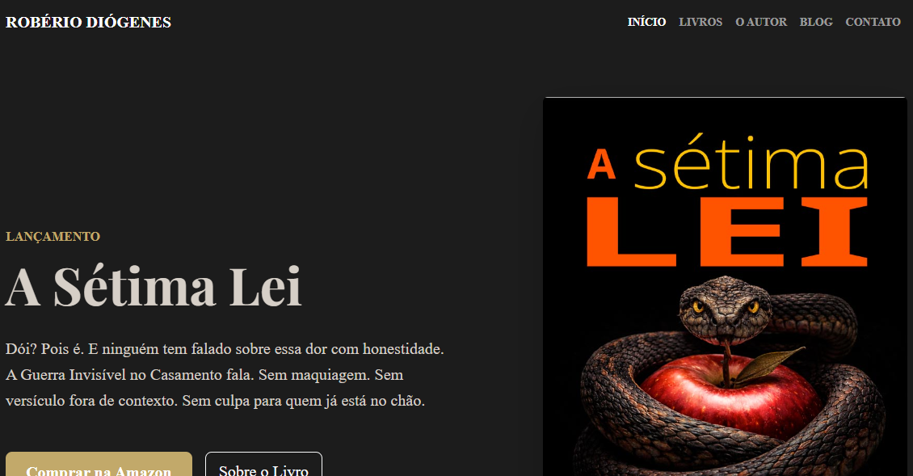

# Robério Diógenes - Website Oficial 📚


Este é o repositório do site oficial do escritor **Robério Diógenes**, focado em literatura independente, suspense psicológico e horror gótico. O projeto foi desenvolvido para servir como catálogo de obras, blog de reflexões e ponto de contato direto com os leitores.

## 🚀 Tecnologias Utilizadas

O projeto foi construído focando em performance, SEO e uma estética "Dark Academia/Noir":

* **HTML5** - Estrutura semântica para melhor indexação no Google.
* **CSS3** - Estilização personalizada com variáveis modernas e animações de scroll.
* **Bootstrap 5** - Sistema de grid responsivo e componentes de interface.
* **JavaScript (Vanilla)** - Lógica de interatividade, progresso de leitura e efeitos de revelação.
* **Font Awesome** - Iconografia social e técnica.
* **Google Fonts** - Tipografia selecionada (Inter e Playfair Display).

## 📂 Estrutura do Projeto

```text
/
├── index.html          # Página principal (Home)
├── autor.html          # Biografia e trajetória
├── css/                # Arquivos de estilo (estilo.css, blog.css)
├── js/                 # Scripts (script.js)
├── img/                # Imagens gerais e fotos
├── capas/              # Galeria de capas dos livros
├── livros/             # Vitrine e páginas individuais das obras
│   ├── index.html      # Catálogo centralizado
│   └── [livro].html    # Páginas específicas de cada obra
└── blogger/            # Estrutura do blog
    ├── index.html      # Vitrine de artigos
    └── [post].html     # Artigos individuais